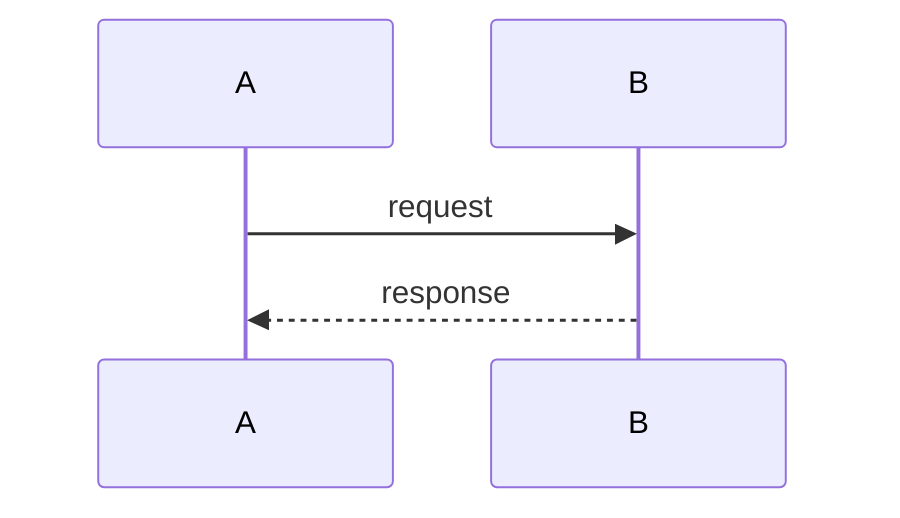

# Plan Studio authoring contract

Plans written to `~/.claude/plans/<slug>.md` are rendered in a local browser app
(Plan Studio), not the terminal. Write **only** standard markdown plus the block
types below. The browser owns 100% of rendering — never emit HTML/CSS/JS, and
never paste large code bodies (use `code-ref` so the UI reads from disk).

Keep the agreed plan structure: **Context → Design → Implementation Steps →
Critical Files → Verification**. Use diagrams when they aid understanding (don't
spam them). Extend **Context** with how the current code works and any external
resources to read.

## 1. Frontmatter (required)

```
---
title: <human title>
root: <ABSOLUTE path to the project this plan is about>
status: draft | ready | done
---
```

`root` is the security jail for `code-ref`: the UI may only read files under it.
Set it to the repo/working dir the plan targets. Omit `root` only for plans that
reference no code.

## 2. `mermaid` — diagrams

**Default to a diagram over prose when explaining flow or structure.** The UI
renders + zooms; on a parse error it shows the raw source, so a broken diagram
never blocks reading. Concrete triggers — emit a diagram when:
- **`sequenceDiagram`** — the plan describes a multi-step request/response or
  control flow across components (client→server→store, hook→process→browser, …).
- **`flowchart`** — data or control crosses **≥3 components**, or there's branching
  (e.g. a validation/decision path). Use for the system/architecture overview.
- **`classDiagram`** — the plan introduces **≥2 new types/modules** and you need to
  show their fields or relationships.

Do **not** add diagrams for trivial one-file changes. Aim for at least one diagram
in any plan that introduces new architecture, a flow, or several interacting pieces.

````

````

## 3. `plan-diff` — proposed code changes (GitHub-style)

A metadata header (`file`, `lang`, optional `old`/`new` for renames) followed by
a unified-diff hunk. The UI renders split/unified with syntax highlighting.

````
```plan-diff
file: src/server.ts
lang: typescript
@@ -10,3 +10,4 @@
-  const raw = fs.readFileSync(path)
+  const raw = await fs.promises.readFile(path)
+  validateSchema(raw)
```
````

## 4. `code-ref` — show EXISTING code without pasting it

Emit only a path (relative to `root`) and a line range. The UI fetches the slice
from disk and highlights it. Use this in Context to explain "how it works today".

````
```code-ref
file: lib/plans.ts
lines: 40-72
note: current load path we're extending
```
````

## 5. `callout` — typed notes

`type` is one of `note` | `background` | `gotcha` | `resource`.

````
```callout
type: gotcha
Watch out: the watcher debounces fs events by 80ms.
```
````

## 6. `resource` — external link card

````
```resource
url: https://example.com/doc
title: Spec we must follow
```
````

## Reminders
- **Before finishing a plan, self-check:** does any section describe a flow, an
  architecture, or several interacting pieces with no diagram? If so, add the
  matching `mermaid` block (see the triggers in §2).
- Author at the right altitude: scannable, recommendation-only, real file paths.
- Prefer `code-ref` over pasted code (saves tokens, stays current).
- The plan is a single hand-editable `.md`; the user can edit any section in the
  browser and edits flow straight back to the file.
